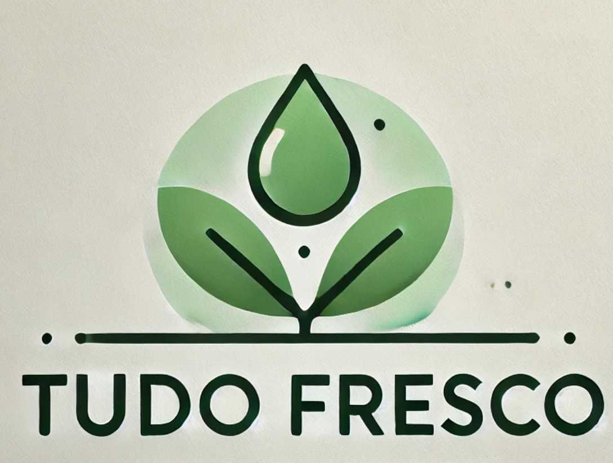

# Tudo Fresco - Plataforma Colaborativa Para Comércio De Alimentos

**Tudo Fresco** é uma plataforma que conecta **produtores locais** a **compradores institucionais e comerciais** interessados em adquirir alimentos frescos de forma direta, justa e eficiente. A proposta da plataforma é incentivar o consumo consciente, a produção sustentável e o fortalecimento da economia local, permitindo que grandes demandas sejam atendidas por diversos pequenos produtores.

---

## Resumo do Sistema

A plataforma **Tudo Fresco** foi desenvolvida com o objetivo de facilitar o encontro entre quem **produz** e quem **compra em escala**, como restaurantes, escolas, hospitais e supermercados. Nosso foco está na construção de um ecossistema digital em que:

- **Compradores** podem registrar suas demandas de forma prática e georreferenciada.
- **Produtores** visualizam demandas próximas à sua localização e podem contatar os compradores para oferecer seus produtos.
- Pequenos produtores tenham mais oportunidades de comercializar suas colheitas, mesmo que em pequenas quantidades.

O sistema está sendo desenvolvido em fases. Atualmente, já entregamos o **MVP** com as funcionalidades essenciais para viabilizar a conexão direta entre produtor e comprador.

---

## Funcionalidades Atuais (MVP)

- **Cadastro de usuários** com possibilidade de vínculo a múltiplas empresas.
- **Cadastro de empresas** do tipo *Comprador* ou *Produtor*, com validação via Receita Federal.
- **Cadastro de endereço comercial** com validação por CEP (Correios) e geolocalização automática (coordenadas aproximadas).
- **Criação e edição de demandas** de compra por empresas do tipo *Comprador*.
- **Cadastro de produtos** com sistema de busca inteligente (autocomplete).
- **Feed de demandas geolocalizado** com scroll infinito (disponível para *Produtores*), exibindo apenas demandas dentro de um raio de 10km.
- **Canal de contato direto** via WhatsApp ou e-mail com mensagens pré-preenchidas com informações da oferta.
- **Gerenciamento de empresas** por usuário (acesso a múltiplas empresas vinculadas à mesma conta).

---

## Funcionalidades Planejadas (Próximas Fases)

- Exibição de **mapa interativo** com pontos de demanda e oferta.
- Inclusão de **certificações orgânicas verificadas** (TECPAR, IBD, EcoCert).
- **Sistema de avaliação** de produtos, entregas e fornecedores.
- **Venda direta de produtos** (sem passar por demandas).
- **Divisão de demandas** entre múltiplos pequenos produtores.
- **Leilões reversos** para compras institucionais.
- **Rede colaborativa** entre produtores e fornecedores de insumos.
- **Sugestões personalizadas** de produtos para compradores.
- **Blog e conteúdo educativo** sobre agricultura sustentável e alimentação saudável.
- **Abertura de vagas temporárias** por produtores.

---

## Arquivos Relacionados

- [📄 Personas](personas.md): Documento com os perfis dos usuários principais da plataforma.
- [⚙️ Requisitos do Sistema](requisitos.md): Requisitos funcionais e não funcionais do projeto, divididos entre MVP e funcionalidades futuras.

---

## Como Contribuir

Se você deseja contribuir para o projeto **Tudo Fresco**, siga estas etapas:

1. Faça um fork deste repositório.
2. Crie uma branch para sua funcionalidade: `git checkout -b feature/nome-da-feature`.
3. Faça commit das alterações: `git commit -am 'Adiciona nova feature'`.
4. Envie para o repositório remoto: `git push origin feature/nome-da-feature`.
5. Abra um pull request para revisão e discussão.

---

## Tecnologias Utilizadas

- **Frontend**: React
- **Backend**: Python
- **Banco de Dados**: PostgreSQL, Firestore
- **Autenticação**: JWT, OAuth
- **Infraestrutura**: Google Cloud Platform

---

## Licença

📌 *TODO: Definir a licença que será utilizada neste projeto.*
